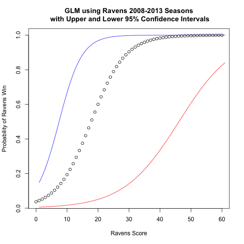

Predicting Win Probability - Ravens 2014
========================================================
author: Leif Ulstrup
date: August 12, 2014
title: JHU Developing Data Products Class Project

Premise
========================================================

The probabilty of the [Baltimore Ravens](http://www.baltimoreravens.com) (under quarterback [Joe Flacco](http://en.wikipedia.org/wiki/Joe_Flacco)) winning a game in 2014 can be predicted using 2008-2013 Win/Loss data to create a generalized linear model relating wins to Ravens points scored.

- Joe Flacco began as Ravens quarterback at the start of the 2008 Season
- Strong offense performance reduces the dependence on defense
- It is fun for fans to assess win probability in the middle of a game

A Shiny web application was created to enable Ravens fans to predict win probability by inputing the current score.

Predicting Ravens Win Prob vs Ravens Score
========================================================

 

Link to Shiny Application
========================================================

Future Explorations
========================================================

Potential future predictive model explorations might include:

- consideration of Home vs Away game as a factor
- Quarter of Play & Time Remaining
- Greater Weighting to Current Season Adjustments
- Inclusion of factors such as Turnover Ratio
- Inclusion of Defense and Offense Key performance and Time Remaining
- Experiment with Machine Learning Methods

GO RAVENS! 
